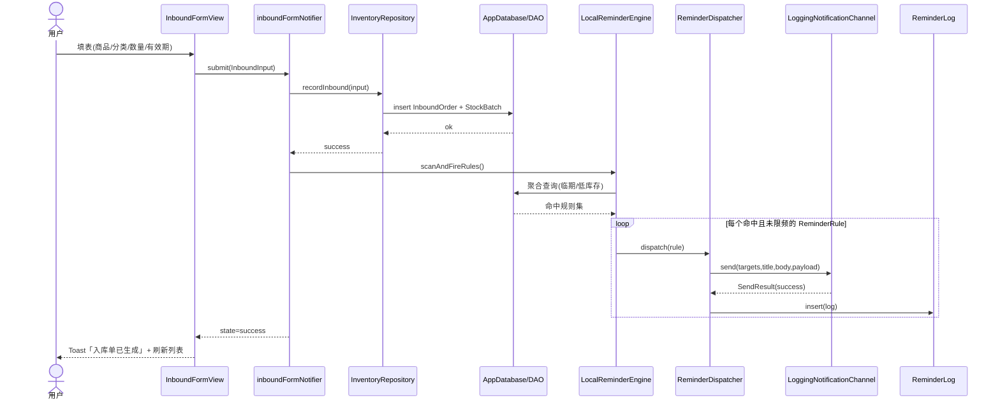
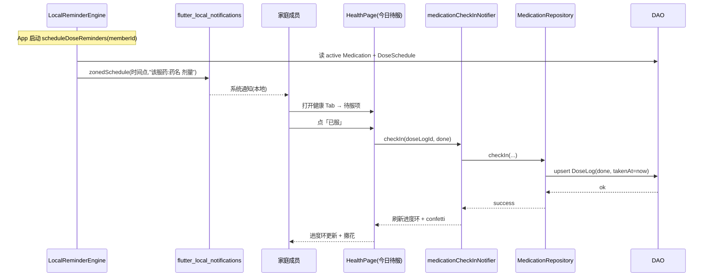
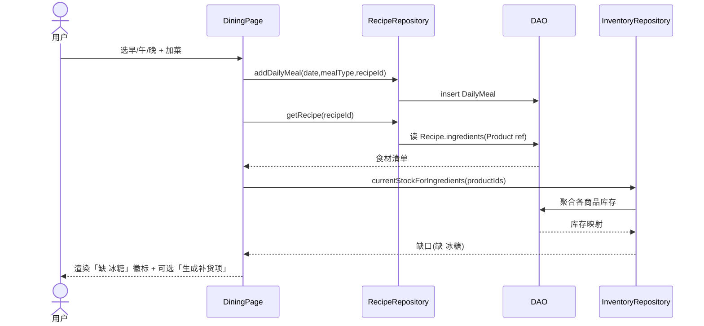
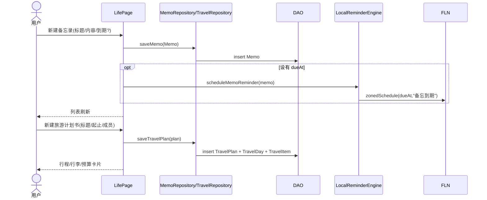
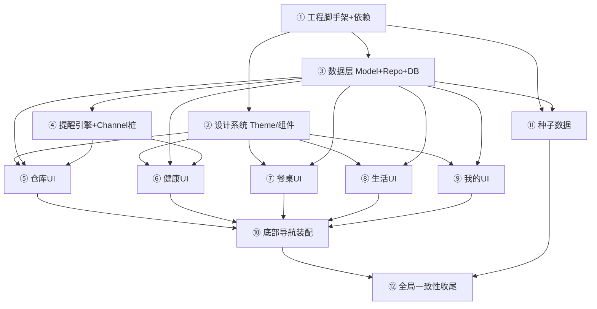

# 综合家庭管家（Family Butler）· 系统架构设计 + 任务分解

> 文档版本：v1.0（架构蓝图，供工程师落地）
> 作者：高见远（架构师）｜ 主形态：Flutter 移动 App ｜ 范围：首版 5 个底部 Tab 的 MVP 体验
> 配套文档：PRD《家庭管家产品设计》（同 `docs/`）、`prototype/DESIGN.md`（设计系统）、`prototype/index.html`（高保真原型）
> 附：类图 `class-diagram.mermaid`、时序图 `sequence-diagram.mermaid`

---

## 0. 文档导航 / 结论速览

| # | 章节 | 一句话结论 |
|---|------|-----------|
| 1 | 实现方案与框架选型 | **Riverpod + Drift(本地优先) + freezed + go_router + flutter_local_notifications/WorkManager**；云端同步 & 微信推送做成**可插拔接口占位** |
| 2 | 文件列表 | feature-first 目录，`lib/` 下约 **62 个文件**（数据层 38 + 共享组件 12 + 5 大模块 UI 12） |
| 3 | 数据结构与接口 | 21 个实体 Model（freezed）+ Repository 接口 + `NotificationChannel`/`ReminderEngine`/`SyncEngine` 抽象与桩 |
| 4 | 程序调用流程 | 入库聚合→预警、用药→提醒→打卡、排菜→食材反查、备忘录/旅游 4 组时序图 |
| 5 | 任务列表 | **12 个有序任务**（遵循主理人枚举），明确依赖与优先级 |
| 6 | 依赖包 | `pubspec.yaml` 包清单与版本策略 |
| 7 | 共享知识 | 命名/令牌映射/日期枚举/ID/软删/统一错误态 跨文件约定 |
| 8 | 待明确事项 | 对 PRD 的假设 + 需用户确认的点 |

> **关于任务粒度的说明**：通用架构师人设默认"≤5 个任务"，但本 Flutter 工程体量明显更大，且主理人已明确给出 12 步分解。本设计**以主理人枚举的 12 任务为准**（更贴合工程师落地），并在 §5 提供 5 阶段 Rollup 供宏观跟踪。

---

## 1. 实现方案与框架选型（含取舍理由）

### 1.1 核心技术挑战

1. **库存事件溯源**：不存绝对值，库存 = Σ入库 − Σ出库（PRD 6.4）。需要**高效聚合查询**（临期扫描、低库存计算、按商品/成员统计）。
2. **本地优先 + 后续云端同步**：首版不接真后端，但要预留同步接口；统一软删 + 字段级 LWW（PRD 6.3/6.4）。
3. **复杂关系建模**：多对多（`Recipe↔Member` 经 `RecipeCookableBy`；`Recipe↔Product` 食材）、一对多（`Member→Medication→DoseSchedule→DoseLog`）。
4. **可靠本地定时提醒**：用药"到点"在 App 生命周期内必须触发；后台受平台限制，需优雅降级。
5. **高保真还原设计系统**：把 DESIGN.md 的 Soft Warm 令牌**严格**映射进 Flutter `ThemeData` + 自定义 `ThemeExtension`，禁止硬编码色值。

### 1.2 框架与库选型（明确推荐）

| 层 | 选型 | 版本策略 | 理由 |
|----|------|---------|------|
| 语言/框架 | **Flutter 3.x**（Dart 3，null safety） | 跟随 stable | 与峰哥经验一致，跨端一套代码 |
| 状态管理 | **flutter_riverpod** + freezed | `^2.5.x` | 编译安全、可测试、Provider 组合清晰，适合中大型 |
| 本地 DB | **Drift**（SQLite，类型安全 + 代码生成） | `^2.16.x` | **推荐**（详见 1.3 取舍） |
| 模型序列化 | **freezed** + `json_serializable` | `^2.5.x` / `^6.8.x` | 不可变 + 模式匹配 + 联合状态；免费集成 JSON |
| 路由 | **go_router** | `^14.0.x` | 声明式 + `ShellRoute` 底部 Tab + 深链/返回栈清晰 |
| 本地通知 | **flutter_local_notifications** + `timezone` | `^17.0.x` | 系统通知 + `zonedSchedule` 精确定时 |
| 后台任务 | **workmanager** | `^0.5.x` | 每日兜底扫描（过期/低库存）；Android 可靠，iOS 受限（占位） |
| 日期/数字 | **intl**（zh_CN locale） | `^0.19.x` | 中文日期、数字千分位/单位格式 |
| 本地配置 | **shared_preferences** | `^2.2.x` | 桩实现：渠道开关、lastSyncAt、当前成员 |
| ID | **uuid** | `^4.4.x` | 生成实体 PK（带前缀） |
| 平台路径 | **path_provider** | `^2.1.x` | DB 文件路径 |

> 不引入：`fluwx`/`cloudbase`/`supabase`（首版不接真后端，仅留接口占位）；图表 `fl_chart`（P2 报表，暂不需要）。

### 1.3 关键取舍：Isar vs Drift —— **明确推荐 Drift**

PRD 9.2 把二者并列，要求给出明确推荐。结论：**首版用 Drift**，理由如下：

| 维度 | Drift（推荐） | Isar | 影响 |
|------|--------------|------|------|
| **维护活跃度** | 作者 Simon Binder 持续维护，社区活跃，版本稳定迭代 | **上游已停止积极维护**（作者转向新项目，仓库基本归档） | 对长期交付项目是**硬风险**——Isar 升级/修 bug 不确定 |
| **聚合查询能力** | 直接写 SQL（DAO `@UseDao` 查询 / drift query API），`SUM/WHERE/JOIN/GROUP BY` 原生高效 | 需 `where().findAll()` 后**内存聚合** | 库存 = Σ入库−Σ出库、临期/低库存扫描、用药统计——Drift 更稳更省 |
| **关系建模** | 表外键 + `join()` 表达多对多/级联清晰 | 集合 + 手动关联 | 本域关系复杂（Recipe↔Member、Recipe↔Product），Drift 更直观 |
| **跨平台** | 移动/桌面/Web 全支持 | Web 支持有限 | 未来多端看板（PRD P2）更顺 |
| **类型安全/代码生成** | build_runner 生成 table/DAO，`.drift` DSL 类型安全 | build_runner 生成 schema/object | 二者摩擦相当 |

**代价**：需写 table 定义 + 跑一次 `build_runner`；SQL 心智负担略高于 Isar 的链式 API。可接受的工程成本。
**备选**：若团队强烈偏好 NoSQL 简洁 API、且愿意承担维护停滞风险，可切 Isar——本设计所有 Repository 接口已抽象，**换底层不影响上层**。

### 1.4 Riverpod 具体用法（Provider 组织方式）

采用 **feature-first + 分层**：全局 Provider 集中在 `lib/providers/app_providers.dart` 做依赖装配（DB、渠道、引擎单例）；每个功能模块在 `features/<module>/providers/*.dart` 暴露"只读 watch Provider"与"动作 Notifier"。

- **依赖装配（app_providers.dart）**
  - `appDatabaseProvider` → `AppDatabase` 单例（lazy）。
  - `notificationChannelProvider` → `LoggingNotificationChannel`（MVP 默认桩，本地日志代替微信）。
  - `reminderDispatcherProvider` → `ReminderDispatcher`（持有 `Map<ChannelType, NotificationChannel>` 注册表）。
  - `reminderEngineProvider` → `LocalReminderEngine`（注入 FLN + WorkManager + dispatcher）。
  - `syncEngineProvider` → `LocalStubSyncEngine`（无操作桩，记录 lastSyncAt）。
  - `currentMemberIdProvider` → `StateProvider<String>`（默认首位成员，健康 Tab 切换）。
- **只读数据流**（以仓库为例，`inventory_providers.dart`）
  - `inventorySummaryProvider`（`FutureProvider`）：件数 / 即将过期数 / 需补货数（供总览三卡）。
  - `expiringSoonProvider(days)`、`lowStockProvider()`：预警视图。
  - `stockBatchesProvider(productId)`、`productsProvider` / `categoriesProvider`。
- **动作 Notifier**（AsyncNotifier / Notifier）
  - 仓库：`inboundFormNotifier`（提交入库 → 调 `InventoryRepository.recordInbound` → 触发 `reminderEngine.scanAndFireRules()`）。
  - 健康：`medicationCheckInNotifier`（打卡 done/skipped → upsert `DoseLog` → 刷新进度环）。
  - 餐桌：`dailyMealNotifier`（排菜 → 反查食材缺口）。
  - 生活：`memoNotifier` / `travelNotifier`。
- **统一状态**：`AsyncValue`（Riverpod 内置）用于 future 加载；UI 联合状态用 freezed `AsyncState<T>`（idle/loading/data/error，见 §7）。

### 1.5 路由方案（底部 Tab + 详情）

- **go_router + `ShellRoute`**：5 个底部 Tab 共享 `AppScaffold`（含 `AppTabBar` + 内容 `child`）。
- **仓库三级子视图做成路由**（贴合原型返回栈）：`/storage`(总览) → `/storage/inbound`(入库) → `/storage/expiring`(即将过期)。
- **健康/餐桌/生活详情页为路由**：`/health/medication/:id`、`/dining/recipe/:id`、`/life/memo/:id`、`/life/travel/:id`、`/mine/members`、`/mine/settings`。
- 成员切换、早午晚切换、Tab 内筛选等**纯视图态用 Widget state**（不需深链）。

### 1.6 本地提醒调度方案

`ReminderEngine`（抽象）→ `LocalReminderEngine`（具体）：
- `init()`：初始化 `flutter_local_notifications`（申请权限）、初始化 `WorkManager`。
- `scheduleDoseReminders(memberId)`：读 active `Medication` → 展开当日 `DoseSchedule` 发生点 → 对每个未来时刻 `flutterLocalNotifications.zonedSchedule(id, 标题, 正文, tz.TZDateTime, ...)`。
- `scanAndFireRules()`：遍历 enabled `ReminderRule`（expiry/lowstock/medication/dailyRecipe/custom）→ 计算命中 → 限频去重（N 分钟内不重推）→ `ReminderDispatcher.dispatch(rule)` → 写 `ReminderLog`。App 每次启动 + 数据变更后调用；并注册 `WorkManager` 每日周期任务作**兜底**（`registerPeriodicTask`，Android 可靠，iOS 受限，文档标注）。
- 备忘录 `dueAt`：同样经 `zonedSchedule` 本地提醒（可选）。

### 1.7 云端同步 & 微信推送：接口占位设计（可插拔）

> 首版**不接真实后端/微信**，全部走桩，但接口与真实实现**形状一致**，后续仅替换具体类并 override Provider。

- **`NotificationChannel`（抽象）** — 统一出口：
  ```dart
  abstract class NotificationChannel {
    ChannelType get type;
    Future<SendResult> send({
      required List<String> targets,        // wxUid / 群 webhook
      required String title,
      required String body,
      Map<String, dynamic>? payload,
    });
  }
  ```
- **桩/占位实现**
  - `LoggingNotificationChannel`（**MVP 默认**）：打印日志 + 本地落 `ReminderLog`，模拟"微信已送达"，让全链路跑通且无副作用。
  - `WxPusherChannel`（占位）：返回 `SendResult(success:false, failureReason:'WxPusher 未配置（需 appToken+用户UID）')`，**不抛异常**便于 dispatcher 优雅降级。预留 REST 调用骨架与 `TODO`。
  - `GroupBotChannel`（占位）：同上，预留企业微信群机器人 Webhook 骨架。
- **`ReminderDispatcher`**：`dispatch(ReminderRule)` → 按 `rule.channel` 从注册表取 channel → `channel.send` → 写 `ReminderLog`；目标 channel 不可用时回退 `LoggingNotificationChannel`。
- **`SyncEngine`（抽象）** → `LocalStubSyncEngine`：`push/pull` 返回成功空操作，更新 `shared_preferences` 的 `lastSyncAt`；标注 `TODO: 替换为 CloudBase/Supabase 实时同步`。

---

## 2. 文件列表及相对路径（lib/ 目录树）

组织方式：**feature-first**（按 5 大模块 + core/shared/data），数据层下沉到 `data/`。共约 **62 个文件**。

```
lib/
├── main.dart                         # 入口：初始化 DB/通知/路由/ProviderScope
├── app.dart                         # MaterialApp + 路由 + 全局 Provider 覆盖
│
├── core/                            # 跨模块基础设施
│   ├── theme/
│   │   ├── design_tokens.dart       # 颜色/圆角/间距/阴影/字号 令牌常量（来自 DESIGN.md）
│   │   ├── app_theme_extension.dart # 自定义 ThemeExtension<AppTheme>（令牌进 Theme）
│   │   └── text_styles.dart         # 字体阶梯（display/sans/num）+ 数据强调样式
│   ├── constants/
│   │   ├── app_constants.dart       # 阈值默认、限频窗口、本地通知渠道 ID
│   │   └── member_colors.dart       # member-1..6 颜色令牌 → Member.color 映射
│   ├── utils/
│   │   ├── id_generator.dart        # uuid v4 + 实体前缀
│   │   ├── datetime_ext.dart        # 本地日期/天数差/过期计算
│   │   └── json_converters.dart     # DateTime/num/枚举/List JSON 转换器
│   ├── error/
│   │   ├── app_exception.dart       # 统一异常
│   │   └── result.dart              # Result<T> / AsyncState<T> (freezed)
│   └── state/
│       └── async_state.dart         # freezed 联合状态 idle/loading/data/error
│
├── data/                            # 数据层（本地优先）
│   ├── local_db/
│   │   ├── app_database.dart        # Drift 数据库类（含所有 Table + DAO 装配）
│   │   ├── tables/                  # 15 张表定义（Dart DSL）
│   │   │   ├── member_table.dart
│   │   │   ├── category_table.dart
│   │   │   ├── product_table.dart
│   │   │   ├── stock_batch_table.dart
│   │   │   ├── inbound_order_table.dart
│   │   │   ├── outbound_order_table.dart
│   │   │   ├── medication_table.dart
│   │   │   ├── dose_schedule_table.dart
│   │   │   ├── dose_log_table.dart
│   │   │   ├── recipe_table.dart
│   │   │   ├── recipe_ingredient_table.dart     # 菜谱↔商品 食材 join
│   │   │   ├── recipe_cookable_by_table.dart    # 菜谱↔成员 谁会做 join
│   │   │   ├── daily_meal_table.dart
│   │   │   ├── memo_table.dart
│   │   │   ├── travel_plan_table.dart
│   │   │   ├── travel_day_table.dart
│   │   │   └── travel_item_table.dart
│   │   ├── daos/                    # 数据访问（含聚合查询）
│   │   │   ├── base_dao.dart        # 软删过滤、通用 upsert
│   │   │   ├── member_dao.dart
│   │   │   ├── inventory_dao.dart   # 入库/出库/批次 + 库存聚合 SQL
│   │   │   ├── medication_dao.dart
│   │   │   ├── recipe_dao.dart
│   │   │   ├── memo_dao.dart
│   │   │   ├── travel_dao.dart
│   │   │   └── reminder_dao.dart
│   │   └── converters/
│   │       └── drift_converters.dart # 枚举/List/TimeOfDay ↔ 存储类型
│   ├── models/                      # 21 个实体（freezed + json_serializable）
│   │   ├── base/
│   │   │   └── sync_entity.dart     # 通用字段 mixin（id/时间戳/version/软删）
│   │   ├── member.dart  category.dart  product.dart  stock_batch.dart
│   │   ├── inbound_order.dart  outbound_order.dart
│   │   ├── medication.dart  dose_schedule.dart  dose_log.dart
│   │   ├── recipe.dart  recipe_ingredient.dart  recipe_cookable_by.dart  daily_meal.dart
│   │   ├── memo.dart
│   │   ├── travel_plan.dart  travel_day.dart  travel_item.dart
│   │   ├── reminder_rule.dart  reminder_log.dart
│   │   └── enums.dart              # 所有枚举（CategoryKind/ChannelType/...）
│   ├── repositories/                # 仓储接口 + 实现（隔离 DB）
│   │   ├── member_repository.dart
│   │   ├── product_repository.dart
│   │   ├── inventory_repository.dart
│   │   ├── medication_repository.dart
│   │   ├── recipe_repository.dart
│   │   ├── memo_repository.dart
│   │   ├── travel_repository.dart
│   │   ├── reminder_repository.dart
│   │   └── repository.dart          # 各 Repository 抽象接口汇总
│   ├── notify/                      # 微信推送可插拔
│   │   ├── notification_channel.dart        # 抽象 + SendResult
│   │   ├── logging_notification_channel.dart# MVP 默认桩
│   │   ├── wxpusher_channel.dart            # 占位（未配置降级）
│   │   ├── group_bot_channel.dart           # 占位
│   │   └── reminder_dispatcher.dart         # 选渠道 + 写 ReminderLog
│   ├── reminder/
│   │   ├── reminder_engine.dart             # 抽象接口
│   │   └── local_reminder_engine.dart       # FLN + WorkManager 实现
│   ├── sync/
│   │   ├── sync_engine.dart                 # 抽象
│   │   └── local_stub_sync_engine.dart      # 无操作桩
│   └── seed/
│       └── seed_data.dart           # 演示数据（原型那一家人）
│
├── features/                        # 5 大模块 UI（各含 page/widgets/providers）
│   ├── storage/                     # 仓库（核心）
│   │   ├── storage_page.dart
│   │   ├── sub_views/
│   │   │   ├── warehouse_overview_view.dart
│   │   │   ├── inbound_form_view.dart
│   │   │   └── expiring_view.dart
│   │   ├── widgets/
│   │   │   ├── summary_grid.dart
│   │   │   ├── stock_list_item.dart
│   │   │   └── expiring_suggestion_item.dart
│   │   └── providers/
│   │       └── inventory_providers.dart
│   ├── health/                      # 健康
│   │   ├── health_page.dart
│   │   ├── widgets/
│   │   │   ├── member_switch.dart
│   │   │   ├── medication_progress_ring.dart
│   │   │   └── med_list_item.dart
│   │   └── providers/
│   │       └── health_providers.dart
│   ├── dining/                      # 餐桌
│   │   ├── dining_page.dart
│   │   ├── widgets/
│   │   │   ├── meal_segment.dart
│   │   │   └── dish_card.dart
│   │   └── providers/
│   │       └── dining_providers.dart
│   ├── life/                        # 生活（备忘录 + 旅游）
│   │   ├── life_page.dart
│   │   ├── memo/
│   │   │   ├── memo_page.dart
│   │   │   ├── memo_list_item.dart
│   │   │   └── memo_providers.dart
│   │   └── travel/
│   │       ├── travel_page.dart
│   │       ├── travel_plan_card.dart
│   │       └── travel_providers.dart
│   ├── mine/                        # 我的
│   │   ├── mine_page.dart
│   │   ├── widgets/
│   │   │   ├── member_list_item.dart
│   │   │   ├── setting_row.dart
│   │   │   └── reminder_channel_switch.dart
│   │   └── providers/
│   │       └── settings_providers.dart
│   └── shared/                      # 共享设计系统组件（严格还原 DESIGN.md）
│       ├── app_card.dart  app_button.dart  app_badge.dart  avatar_dot.dart
│       ├── app_switch.dart  app_chip.dart  app_stepper.dart  progress_ring.dart
│       ├── empty_state.dart  app_header.dart  toast.dart  confetti.dart
│       └── app_tab_bar.dart         # 底部 5 Tab（ShellRoute 渲染）
│
├── router/
│   └── app_router.dart              # go_router：ShellRoute + 各模块路由
│
└── providers/
    └── app_providers.dart           # 全局 Provider 装配（DB/渠道/引擎/当前成员）
```

> 说明：`.g.dart`（freezed/drift/json_serializable 生成文件）由 `build_runner` 产出，不计入手写文件；实际落地后文件数略多于 62（生成文件另算）。

---

## 3. 数据结构和接口（类图 / Dart 类骨架）

> 完整 Mermaid 见 `class-diagram.mermaid`。以下为关键类骨架与接口签名（仅结构，不写实现）。

### 3.1 通用基类与枚举

```dart
/// 所有实体的通用字段（PRD 6.3）
mixin SyncEntity {
  String get id;
  DateTime get createdAt;
  DateTime get updatedAt;
  int get version;
  DateTime? get deletedAt;
  bool get isDeleted => deletedAt != null;
}

/// 枚举集中定义（examples）
enum CategoryKind { food, medicine, daily, other }
enum OutboundReason { consume, discard, other }
enum MedicationType { medicine, supplement }
enum Frequency { dailyN, specific }
enum DoseStatus { pending, done, skipped }
enum ChannelType { wxpusher, groupBot, oa, miniProgram, localLog }
enum ReminderType { expiry, lowstock, medication, dailyRecipe, custom }
enum MealType { breakfast, lunch, dinner, snack }
enum TravelItemType { luggage, budget }
enum MemberRole { admin, member }
```

### 3.2 实体 Model（freezed 示例）

```dart
@freezed
class Product with _$Product, SyncEntity {
  const factory Product({
    required String id,
    required String name,
    required String categoryId,
    required String unit,
    String? barcode,
    String? location,
    @Default(1) int lowStockThreshold,
    required DateTime createdAt,
    required DateTime updatedAt,
    @Default(1) int version,
    DateTime? deletedAt,
  }) = _Product;
  factory Product.fromJson(Map<String, dynamic> json) => _$ProductFromJson(json);
}

@freezed
class StockBatch with _$StockBatch, SyncEntity {
  const factory StockBatch({
    required String id,
    required String productId,
    required num quantity,
    DateTime? expireDate,
    String? batchNo,
    required DateTime inboundAt,
    required DateTime createdAt,
    required DateTime updatedAt,
    @Default(1) int version,
    DateTime? deletedAt,
  }) = _StockBatch;
  factory StockBatch.fromJson(Map<String, dynamic> json) => _$StockBatchFromJson(json);
}

@freezed
class Medication with _$Medication, SyncEntity {
  const factory Medication({
    required String id,
    required String memberId,
    required String name,
    required MedicationType type,
    required String dosage,
    required Frequency frequency,
    @JsonKey(fromJson: _timesFromJson, toJson: _timesToJson)
    required List<TimeOfDay> times,
    DateTime? startDate,
    DateTime? endDate,
    @Default(true) bool active,
    required DateTime createdAt,
    required DateTime updatedAt,
    @Default(1) int version,
    DateTime? deletedAt,
  }) = _Medication;
  factory Medication.fromJson(Map<String, dynamic> json) => _$MedicationFromJson(json);
}
/// DoseLog / Recipe / TravelPlan / ReminderRule 等同构（略，结构见类图）
```

### 3.3 Repository 接口（抽象，隔离 DB）

```dart
abstract class InventoryRepository {
  /// 入库：写入 InboundOrder + StockBatch（append-only 事件）
  Future<void> recordInbound({
    required String productId,
    required num qty,
    required String operatorId,
    String? batchNo,
    DateTime? expireDate,
    String? note,
  });
  Future<void> recordOutbound({
    required String productId,
    required num qty,
    required OutboundReason reason,
    required String operatorId,
    String? note,
  });
  /// 库存聚合：Σ InboundOrder.qty − Σ OutboundOrder.qty
  Future<num> currentStock(String productId);
  /// 临期：expireDate − today ≤ days
  Future<List<StockView>> expiringSoon(int days);
  /// 低库存：currentStock ≤ Product.lowStockThreshold
  Future<List<StockView>> lowStock();
  Stream<List<Product>> watchProducts();
}

abstract class MedicationRepository {
  Future<void> checkIn(String doseLogId, DoseStatus status, {DateTime? takenAt, String? note});
  Future<List<DoseLog>> todayDoses(String memberId);
  Stream<List<Medication>> watchByMember(String memberId);
}
/// MemberRepository / RecipeRepository / MemoRepository / TravelRepository / ReminderRepository 同构
```

### 3.4 可插拔接口：NotificationChannel / ReminderEngine / SyncEngine

```dart
/// 微信提醒统一出口（PRD 8.1）
abstract class NotificationChannel {
  ChannelType get type;
  Future<SendResult> send({
    required List<String> targets,
    required String title,
    required String body,
    Map<String, dynamic>? payload,
  });
}

@freezed
class SendResult with _$SendResult {
  const factory SendResult({required bool success, String? message, String? failureReason})
      = _SendResult;
}

/// MVP 默认桩：本地日志代替微信
class LoggingNotificationChannel implements NotificationChannel {
  @override ChannelType get type => ChannelType.localLog;
  @override
  Future<SendResult> send({required List<String> targets, required String title,
      required String body, Map<String, dynamic>? payload}) async {
    debugPrint('[Notify][LOG] -> $targets | $title | $body');
    return const SendResult(success: true, message: 'logged');
  }
}

/// 占位（未配置优雅降级，不抛异常）
class WxPusherChannel implements NotificationChannel {
  @override ChannelType get type => ChannelType.wxpusher;
  @override
  Future<SendResult> send({required List<String> targets, required String title,
      required String body, Map<String, dynamic>? payload}) async {
    // TODO: 调 WxPusher REST（需 appToken + 用户 UID）
    return const SendResult(success: false, failureReason: 'WxPusher 未配置');
  }
}

/// 调度与下发
abstract class ReminderEngine {
  Future<void> init();
  Future<void> scheduleDoseReminders(String memberId);
  Future<void> scanAndFireRules();
}

class ReminderDispatcher {
  final Map<ChannelType, NotificationChannel> _registry;
  ReminderDispatcher(this._registry);
  Future<ReminderLog> dispatch(ReminderRule rule) async {
    final ch = _registry[rule.channel] ?? _registry[ChannelType.localLog]!;
    final res = await ch.send(targets: _targetsOf(rule), title: ..., body: ...);
    return ReminderLog(/* status from res, firedAt: now */);
  }
}

/// 云端同步桩
abstract class SyncEngine {
  Future<SyncResult> push(List<SyncEntity> changes);
  Future<List<SyncEntity>> pull(DateTime since);
}
class LocalStubSyncEngine implements SyncEngine {
  // TODO: 替换为 CloudBase/Supabase；当前无操作 + 更新 lastSyncAt
}
```

### 3.5 类图（Mermaid，完整版见 class-diagram.mermaid）

要点：
- `SyncEntity` mixin 被全部 21 实体继承。
- `Product` 1—* `StockBatch` / `InboundOrder` / `OutboundOrder`（均经 productId 关联）。
- `Member` 1—* `Medication` 1—* `DoseSchedule` 1—* `DoseLog`；`Member` 经 `RecipeCookableBy` *—* `Recipe`；`Recipe` 1—* `RecipeIngredient`(→Product) 与 1—* `DailyMeal`。
- 仓储接口、NotificationChannel 继承树、ReminderEngine/SyncEngine 抽象与桩均入图。

---

## 4. 程序调用流程（时序图，Mermaid）

> 完整版见 `sequence-diagram.mermaid`，此处给出 4 组核心流程。

### 4.1 入库 → 库存聚合 → 临期/低库存预警



### 4.2 用药到点 → 提醒 → 打卡



### 4.3 菜谱排菜 → 食材反查



### 4.4 备忘录 / 旅游计划书



---

## 5. 任务列表（有序 + 依赖 + 优先级）

> 遵循主理人枚举的 12 步；依赖指"前置任务"，P0 最高。

| ID | 任务 | 主要文件（来自 §2） | 依赖 | 优先级 |
|----|------|-------------------|------|--------|
| **T01** | 工程脚手架 + 依赖 + pubspec | `pubspec.yaml`、`main.dart`、`app.dart`、`analysis_options.yaml`(riverpod_lint) | — | P0 |
| **T02** | 设计系统 Theme/令牌组件 | `core/theme/*`、`core/constants/member_colors.dart`、`features/shared/*`(12 个组件) | T01 | P0 |
| **T03** | 数据层 Model + Repository + 本地 DB | `data/models/*`(21 实体)、`data/local_db/*`(15 表+DAO)、`data/repositories/*` | T01 | P0 |
| **T04** | 提醒引擎 + 调度器 + Channel 桩 | `data/reminder/*`、`data/notify/*`、`data/sync/*` | T03 | P1 |
| **T05** | 仓库模块 UI | `features/storage/*`(page+3 子视图+3 widget+providers) | T02,T03,T04 | P0 |
| **T06** | 健康模块 UI | `features/health/*` | T02,T03,T04 | P0 |
| **T07** | 餐桌模块 UI | `features/dining/*` | T02,T03 | P1 |
| **T08** | 生活模块 UI（备忘录+旅游） | `features/life/*` | T02,T03 | P1 |
| **T09** | 我的模块 UI | `features/mine/*` | T02,T03 | P1 |
| **T10** | 底部导航装配 + 路由 | `router/app_router.dart`、`features/shared/app_tab_bar.dart`、`app.dart` | T05,T06,T07,T08,T09 | P0 |
| **T11** | 种子数据 / 演示数据 | `data/seed/seed_data.dart` | T03 | P1 |
| **T12** | 全局一致性收尾 | 全模块联调、`providers/app_providers.dart` 装配校验、空状态/动效核对 | T10,T11 | P0 |

### 5.1 任务依赖图（Mermaid）



### 5.2 五阶段 Rollup（宏观跟踪，对应通用架构师人设的 ≤5 约束）

1. **基础设施**（T01）→ 2. **设计系统**（T02）→ 3. **数据+提醒底座**（T03,T04）→ 4. **五大模块 UI**（T05–T09）→ 5. **装配+收尾**（T10–T12）。

---

## 6. 依赖包列表（pubspec.yaml 用）

```yaml
dependencies:
  flutter:
    sdk: flutter
  flutter_localizations:
    sdk: flutter

  # 状态管理
  flutter_riverpod: ^2.5.1
  riverpod_annotation: ^2.3.5

  # 模型（不可变 + JSON）
  freezed_annotation: ^2.4.4
  json_annotation: ^4.9.0

  # 本地 DB（Drift / SQLite，类型安全 + 代码生成）
  drift: ^2.16.0
  drift_flutter: ^0.2.1
  sqlite3_flutter_libs: ^0.5.20
  path_provider: ^2.1.2
  path: ^1.9.0

  # 路由
  go_router: ^14.1.0

  # 本地通知 + 后台
  flutter_local_notifications: ^17.0.0
  timezone: ^0.9.3
  workmanager: ^0.5.2

  # 工具
  intl: ^0.19.0
  shared_preferences: ^2.2.3
  uuid: ^4.4.0

dev_dependencies:
  flutter_test:
    sdk: flutter
  flutter_lints: ^3.0.0
  riverpod_lint: ^2.3.10
  riverpod_generator: ^2.4.0
  freezed: ^2.5.2
  json_serializable: ^6.8.0
  drift_dev: ^2.16.0
  build_runner: ^2.4.11
```

**版本策略**：主版本锁 `^` 次版本，允许补丁；`build_runner` 全家仅 dev。生成产物（`*.freezed.dart`、`*.g.dart`）加入 `.gitignore` 或随构建生成。落地时以 `flutter pub get` 解析到的兼容版本为准，遇冲突优先升级 drift/riverpod 到最新稳定。

---

## 7. 共享知识（跨文件约定）

### 7.1 命名规范
- 文件：`snake_case`；类：`PascalCase`；Provider：`*Provider` / Notifier：`*Notifier` / Repository：`*Repository` / Page：`*Page` / 子视图：`*View` / Widget：`*Card|*Item|*Row`。
- 实体 ID 前缀：`mem_/cat_/prd_/bat_/ino_/out_/med_/sch_/log_/rcp_/ing_/cb_/meal_/memo_/trv_/day_/item_/rule_`。
- 颜色/令牌常量集中在 `design_tokens.dart`，**禁止在 Widget 硬编码 hex**。

### 7.2 设计令牌映射（DESIGN.md → Flutter）
- `ThemeData`：`colorScheme` 用 `ColorScheme.light` 以 `--color-bg` 为 background、`--color-surface` 为 surface、`--color-primary` 为 primary（primary 上用深字，见下）；`textTheme` 套 `text_styles.dart`（display/sans/num 字体阶梯）；`cardTheme.shape=RoundedRectangleBorder(20px)`；`elevatedButtonTheme` 胶囊 + 主色深字。
- **自定义 `ThemeExtension<AppTheme>`**：承载 DESIGN.md 无法进 `ColorScheme` 的令牌——`radius`(card/button/input/modal/avatar)、`spacing`(1..7)、`shadow`(xs..lg + primary/press)、`gradientHeader`、`badge` 语义色对、`memberColors[6]`、动效曲线/时长。
- 用法：`Theme.of(context).extension<AppTheme>()!.primarySoft` / `AppTheme.of(context).space4`。
- **反模式（来自 DESIGN.md §7 Never Do）**：主色亮面禁用白字（用 `--color-text-primary` 深字）；语义红/黄走"浅底深字"徽标；圆角/柔和投影/圆头像严格遵循；健康场景动效克制。

### 7.3 日期 / 枚举 / 数字
- 存储：**UTC `DateTime`**；展示：本地时区，用 `intl` + `zh_CN`（"6 月 18 日 · 周三"）。
- 过期计算：`datetime_ext.daysUntil(expireDate)`；临期阈值默认 3 天（可配置）。
- 枚举：freezed `@JsonValue` 或 `json_serializable` 存字符串；Drift 存为 `text` 经 `drift_converters.dart` 转换。
- 数据强调：库存/天数用 `--font-num` 放大 + 主色（`data-num` 样式 → Flutter `TextStyle` + 条件色 `is-danger/is-warning/is-success`）。

### 7.4 ID 生成 / 软删 / 版本
- `id_generator.newId('prd_')` → `uuid v4` 带前缀。
- **软删**：所有读路径在 `base_dao` 默认 `WHERE deleted_at IS NULL`；删除=更新 `deletedAt`。
- **版本/LWW**：写时 `version+1`、`updatedAt=now`；同步合并按 `updatedAt` + `version` 字段级 last-write-wins（PRD 6.4）。

### 7.5 统一错误 / 加载态
- 仓储返回失败抛 `AppException`（携带 code/message）；或 `Result<T>`（ok/err）。
- UI：`AsyncValue`（Riverpod 内置）处理 future 加载/错误；复杂联合态用 freezed `AsyncState<T> { idle / loading / data(T) / error(Object) }`，`async_state.dart` 统一，避免各页面重复写三态。
- 全局 Toast（成功/错误）走 `features/shared/toast.dart`，与 prototype 的 toast 一致。

---

## 8. 待明确事项

### 8.1 对 PRD 已采纳的假设（默认）
1. **本地 DB = Drift**（见 §1.3），非 Isar。
2. **模型用 freezed**（不可变 + 模式匹配 + 联合状态），非纯 class + json_serializable。
3. **路由用 go_router + ShellRoute**；仓库三级子视图做成路由（非纯 Widget state）。
4. **提醒本地化**：用药点到用 `flutter_local_notifications.zonedSchedule` + App 启动重排；每日过期/低库存扫描用 `WorkManager` 周期任务（Android 可靠，iOS 标记受限）。
5. **云端同步 & 微信推送 = 接口占位**（Logging 桩默认），不接真后端；真实实现仅替换具体类并 override Provider。
6. **成员颜色**：`Member.color` 存 int（来自 DESIGN member-1..6 令牌），`member_colors.dart` 提供映射；原型 5 人（爸/妈/宝/奶/爷）+ 其他。

### 8.2 需用户（峰哥）后续确认的点
1. **真实后端选型**：CloudBase（腾讯云，微信登录顺）vs Supabase（开源 SQL）？影响 `SyncEngine` 真实实现与 fluwx 集成时机。
2. **微信凭证**：WxPusher `appToken` + 家庭成员 `UID`、企业微信群机器人 Webhook——用于把占位 `WxPusherChannel`/`GroupBotChannel` 接真。
3. **生活 Tab 范围**：原型中"生活"是**空态 + 路线图**（备忘录/旅游"建设中"）。首版是要①仅还原原型空态占位，还是②做**基础可交互 CRUD**（备忘录置顶/完成/到期 + 旅游计划书行程/行李/预算）？**建议②**（数据模型已齐备，成本可控），请确认。
4. **餐桌 Tab 范围**：原型只含"今日菜单"浏览（早/午/晚 + 谁会做 + 缺料徽标）。菜谱库管理 / 排菜编辑是否纳入首版，还是仅浏览？建议首版**浏览 + 基础排菜**，菜谱库编辑放 P1。
5. **iOS 后台限制**：`WorkManager` 在 iOS 无法保证周期执行，是否接受"iOS 仅靠 App 前台扫描 + 云函数兜底"（需后端）？首版本地桩阶段 iOS 后台提醒可能不触发，需知晓。
6. **用药合规**：保持"提醒/记录工具"定位，不提供医疗建议——已在 UI 文案规避，确认无额外合规要求。

---

*文档结束 · 下一步：工程师依据本设计 + `class-diagram.mermaid` + `sequence-diagram.mermaid` 按 T01→T12 落地。*
